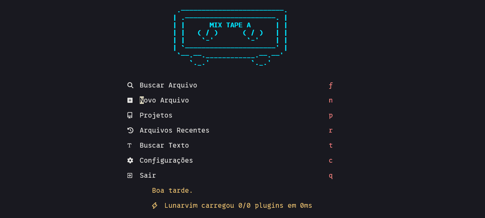
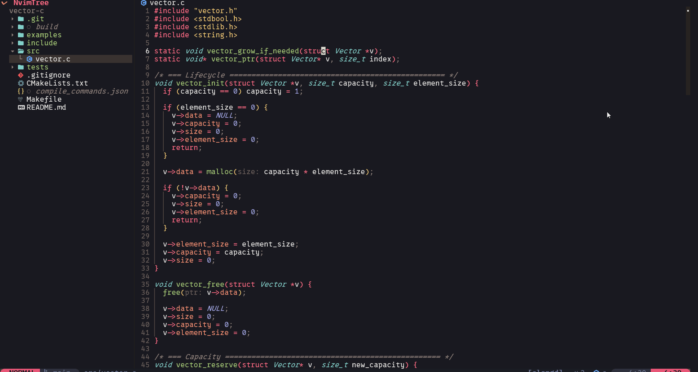
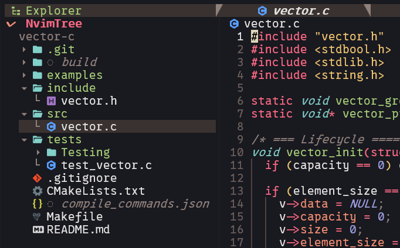
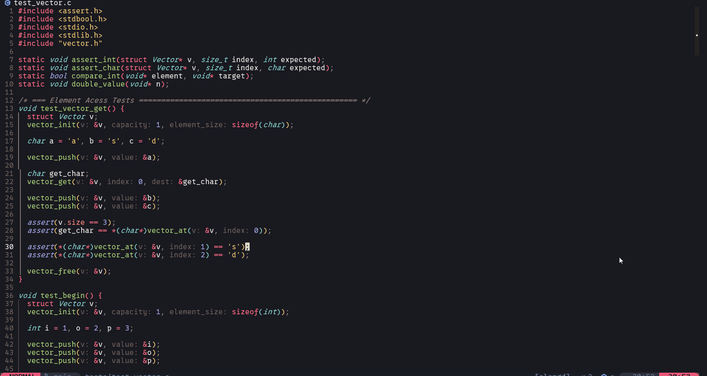

# 🌙 MjScrim's LunarVim Dotfiles

  
   
  
<i>Configuração rápida, limpa e focada em produtividade rodando no Arch Linux (WSL).</i>

---

Uma configuração rápida, limpa e focada em produtividade/beleza. Construída sob medida para lidar com **C** até o desenvolvimento robusto de APIs em **Java (Spring)**.

## 📸 Visual

### 💻 Visão Geral do Editor
 

  

 

### 📂 NvimTree & Navegação
 

  

 

### ✨ Animações e UI Responsiva
 

  

 

## ✨ Principais Características

- **Suporte C/C++ de Alto Nível:** Configuração do `clangd` otimizada para integração perfeita com CMake e Makefiles (suporte total e reconhecimento instantâneo do `compile_commands.json`).
- **Ecossistema Java:** Ambiente preparado para navegação rápida e autocompletar inteligente em projetos Java(Ainda com alguns problemas)..
- **Navegação Cirúrgica:** Integração total com o Telescope para buscar arquivos, referências e ponteiros.
